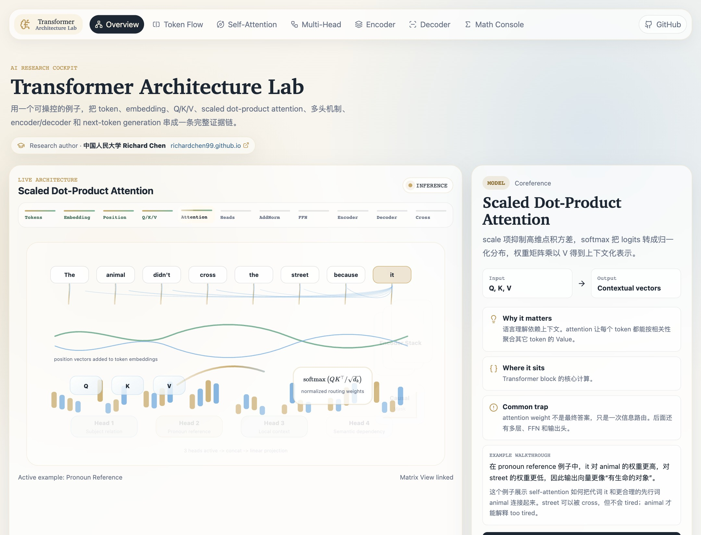
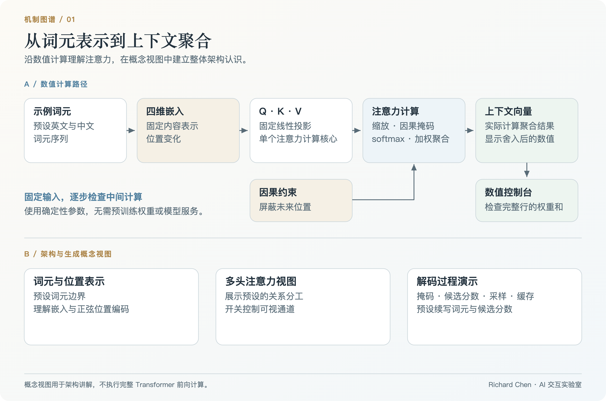
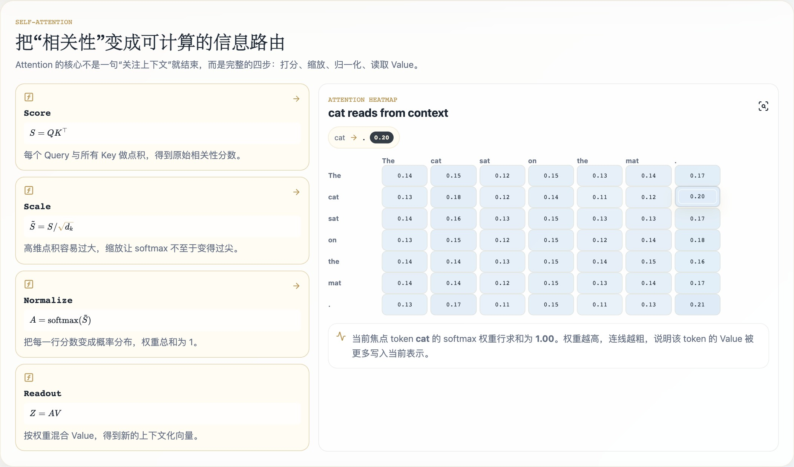
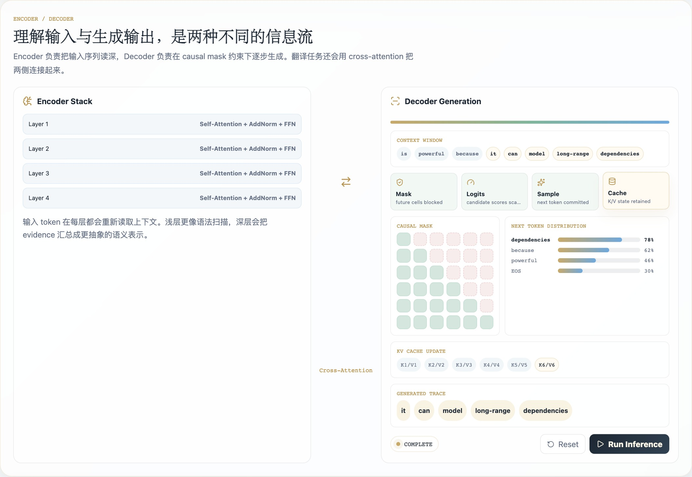

# Transformer Architecture Lab

**Make attention an observable process.**

A visual workbench for following a sentence through tokens, vector representations, Q/K/V projections, attention weights, and contextual readout. Move between animated explanations and inspectable numbers without losing the example you are studying.

[**Open the lab ↗**](https://richardchen99.github.io/transformer-architecture-lab/) · [Research note · 中文](https://richardchen99.github.io/blog/transformer-architecture-lab-note/) · [中文 README](README.zh-CN.md) · [Quick start](#quick-start)

Created by **Richard Chen · Renmin University of China / 中国人民大学** · [Homepage](https://richardchen99.github.io)

[](https://richardchen99.github.io/transformer-architecture-lab/)

*A real application capture. The same example connects the architecture view, attention matrix, and mathematical explanation.*

## What you can investigate

| Question | Experiment | Observable result |
| --- | --- | --- |
| How does a token gather context? | Follow Q/K/V into scaled dot-product attention | Scores become a distribution, then a weighted sum of Values |
| What changes under a causal mask? | Compare unrestricted and causal attention | Future positions are excluded from the readout |
| What do the intermediate numbers mean? | Open Matrix View and the Math Console | Inspect embeddings, projections, weights, and context vectors |
| How do the larger blocks fit together? | Explore head lanes, residual/FFN, and encoder/decoder views | Connect the numerical attention core to the architecture schematic |
| How does autoregressive decoding unfold? | Play Next Token Prediction | Follow a scripted token sequence and its illustrated cache slots |

Five built-in cases cover **pronoun reference, translation, next-token prediction, long-context dependency, and Chinese token boundaries**. Beginner, Research, and Mathematical modes offer different levels of explanation. The interface uses English controls with Chinese explanatory text.

## Architecture at a glance



*Original schematic: a numerical attention core surrounded by explanatory architecture views. [Editable SVG](docs/assets/architecture.svg) · [Figure provenance](docs/assets/README.md).*

## A two-minute experiment

1. Open the lab, select **Machine Translation**, and enter **Research** mode.
2. Choose **Scaled Dot-Product Attention** and **Matrix View**. Follow a Query across the seven-token attention row.
3. Compare raw dot products, scaled scores, and softmax weights in the numerical views. Check the full-row sum, which is approximately one.
4. Switch to **Next Token Prediction** and play the decoder sequence. Observe how the causal information boundary advances with each illustrated step.

The translation case keeps the full attention row visible. For longer examples, a displayed matrix or console slice may omit columns; normalization applies to the **full row**, not necessarily the visible slice.

<details>
<summary><strong>Inspect the attention and decoding views</strong></summary>



*Attention inspection: all seven token columns are visible, with the full-row check displaying 1.00.*



*Decoder walkthrough: token order and cache slots explain the generation process; this panel uses a scripted continuation.*

</details>

## Computation and scope

The attention utility computes deterministic four-dimensional embeddings, fixed linear projections, dot products, scaling, optional causal masking, softmax, and Value readout:

$$
Q=XW_Q,\qquad K=XW_K,\qquad V=XW_V,
$$

$$
A=\mathrm{softmax}\left(\frac{QK^\top}{\sqrt{d_k}}+M\right),
\qquad Z=AV.
$$

Here, softmax is row-wise; the mask is zero for permitted positions and negative infinity for excluded positions. Intermediate values are rounded to three decimals for the demonstration, so numerical checks are approximate.

The surrounding views explain the broader architecture. Head toggles change visual lanes rather than independently computed head outputs. Encoder/decoder stacks are conceptual; decoding uses fixed candidate scores and scripted tokens, and its cache slots do not implement numerical KV reuse. Candidate scores are illustrative and need not form a probability distribution. Token boundaries are preset, and the vectors are not trained model weights.

This makes the lab useful for **teaching, architecture walkthroughs, and reading attention code**. For a numerical cache-equivalence experiment, continue to [LLM Inference Lab](https://github.com/richardchen99/llm-inference-lab).

## Quick start

Use **Node.js 24** and npm.

```bash
git clone https://github.com/richardchen99/transformer-architecture-lab.git
cd transformer-architecture-lab
npm ci
npm run dev -- --host 127.0.0.1
```

```bash
npm run build
npm run preview -- --host 127.0.0.1
```

React, TypeScript, Vite, Framer Motion, and KaTeX power the static application. The experiment runs in the browser; the asynchronous API-shaped helpers are local stubs. No model API key or GPU is required.

The [Pages workflow](.github/workflows/deploy.yml) builds and deploys `main` with Node 24. There is currently no automated test script in this repository. A fork can deploy `dist/` after selecting **GitHub Actions** as its Pages source.

## Read the implementation

| Entry point | What to look for |
| --- | --- |
| [`src/lib/attention.ts`](src/lib/attention.ts) | Deterministic embeddings, Q/K/V, masking, softmax, and context vectors |
| [`src/components/`](src/components/) | Attention inspection, head lanes, architecture panels, and decoder playback |
| [`src/data/`](src/data/) | Preset examples and explanatory material |
| [`src/api/labApi.ts`](src/api/labApi.ts) | Local asynchronous stubs used by the interface |
| [`src/App.tsx`](src/App.tsx) · [`src/styles.css`](src/styles.css) | Shared experiment state and visual system |

## Reading and citation

- Vaswani et al. [*Attention Is All You Need*](https://arxiv.org/abs/1706.03762), 2017 — the original Transformer.
- Harvard NLP. [*The Annotated Transformer*](https://nlp.seas.harvard.edu/annotated-transformer/) — an implementation-oriented companion.
- [Project research note](https://richardchen99.github.io/blog/transformer-architecture-lab-note/) — a Chinese walkthrough connecting the visual modules.

If this lab supports your teaching or writing, link to the repository and record the commit you used. Machine-readable software attribution is available in [CITATION.cff](CITATION.cff).

## Explore the series

| Lab | Central question |
| --- | --- |
| [Tokenizer Playground](https://github.com/richardchen99/tokenizer-playground) | How does a corpus become a reusable vocabulary? |
| **Transformer Architecture Lab** | How does attention turn token representations into context? |
| [Position Encoding Lab](https://github.com/richardchen99/position-encoding-lab) | How does position change attention geometry? |
| [LLM Inference Lab](https://github.com/richardchen99/llm-inference-lab) | When can past computation be reused? |
| [LLM RL Lab](https://github.com/richardchen99/llm-rl-lab) | How does reward change a response distribution? |

Found it useful? A star helps others discover the series. Reproducible issues and focused improvements to the experiments are welcome.
